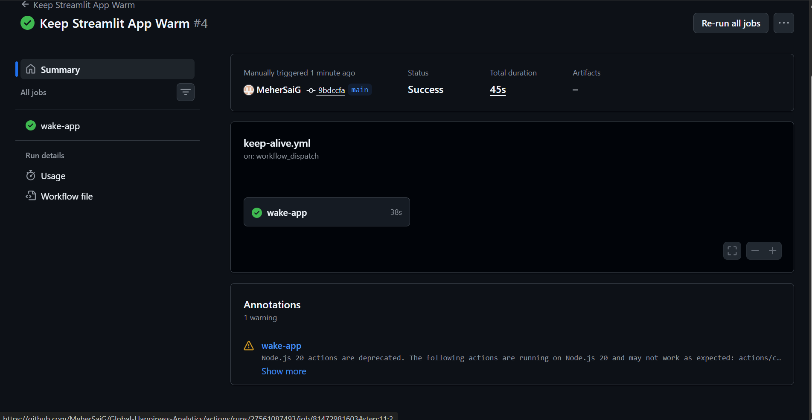

# Streamlit Keep Alive Workflow

## Objective

Created a GitHub Actions workflow using Playwright to periodically access a deployed Streamlit application and keep it active.

## Technologies Used

* GitHub Actions
* Playwright
* Node.js
* Streamlit

## Files

* `keep-alive.yml` – GitHub Actions workflow file

## Streamlit Application

https://global-happiness-analytics-kkwudzcjizeg7vao4xnrxc.streamlit.app/

## Screenshots

### Workflow Execution

## Conclusion

Implemented an automated workflow that periodically opens the Streamlit application using Playwright and GitHub Actions.
